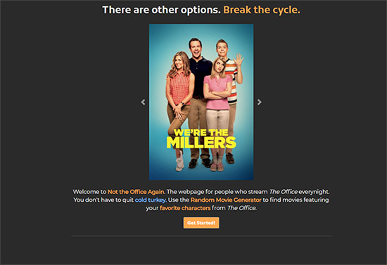

# Not The Office Again :popcorn:

## Front End Capstone
### Nashville Software School, Evening Cohort 12
[ntoa.logandevelopment.io](https://ntoa.logandevelopment.io) 

**Not the Office Again** attemps to solve a very serious problem in my household and many others. Do you or someone you love have an addiction to *The Office*? Use **Not the Office Again** to break the cycle. Our Random Movie Generator returns movies featuring your favorite characters from *The Office*. You don't have to quit cold turkey :turkey:. 

## Features:
* **Google Authentication**: Log in with google to keep track of movies you have added to your watchlist, and update your watchlist when you have watched a movie. 
* **Random Movie Generator**: Not the Office Again uses the [TMDb API](https://developers.themoviedb.org/) to retrieve movies featuring your favorite characters from *The Office*. 
* **Quotes from The Office**: The back of every movie poster on the Random Movie Generator features a quote from *The Office* pulled from *Firebase*. Quote database was created for this project and features over 150 quotes.
* **User Watchlist**: User watchlists are stored on and retrieved from *Firebase*. Authenticated users can perform full CRUD on their watchlist. 
* **Track Your Progress**: Track your progress through the program. Everytime you mark a movie as watched, your progress is updated. Complete the program by watching 10 movies and open the door to a new world of content.
* **Responsive Design**: Project is optimized for viewing and using on phones and tablets.

## Screenshots:
#### Landing Page: 

#### Random Movie Generator: 

#### Watchlist

#### Site Preview

## Technologies:
* React
* React Router
* Axios
* Firebase
* [TMDb API](https://developers.themoviedb.org/)
* Vanilla JS
* SCSS
* MomentJs

## How to Run
> Site is deployed at [ntoa.logandevelopment.io](https://ntoa.logandevelopment.io) 
